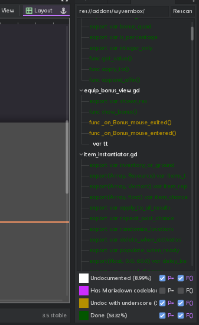

# Documentation Checklist

    "I made the addon to make the addon!"

Helps see where you don't have comments on properties and methods inside scripts. Useful for writing addons, as comments are shown as documentation in external editors.

- Double-click to show line in script editor;
- Lists undocumented members in white, documented in dark green;
- Members starting with underscores are highlighted differently if you want to keep them private;
- Checkboxes to hide properties `P=` and methods `F=` of any category
- Shows where Markdown codeblocks were used (shown as code in VSCode, but not in Godot 4 auto-docs)

For now, only supports GDScript.

